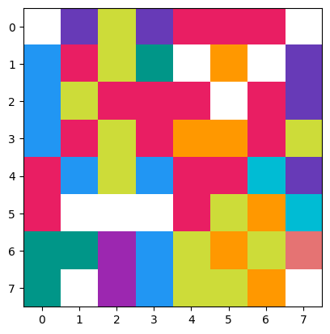
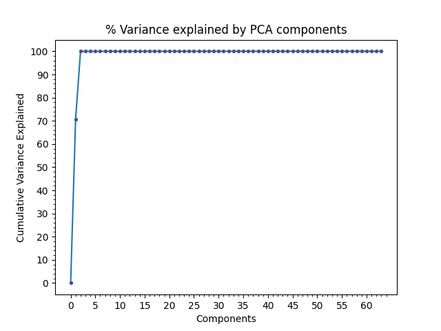

# To IB
## *_This is my IB math EE research submited for June 2022, so do not mark it for plagerism thank you_*

# PCA Image compression _(not SVD)_  
The script uses PCA (princial component analysis) to perform image compression. PCA is not limited to image compression, it can be used to compress a variety of multivariable datasets.
- PCA is very similar to SVD in principal but the two uses two different techniques in its calculation to perform compression. 
- This is a <u>_lossy_</u> compression technique. Data will be lost when compression is performed
- see the PDF file for the maths

PCA breaks down the matrix(which often is a data table with multiple variables) into Eigenvectors and Values known as Eigen decomposition. These Eigenvectors are called components

Given this 8x8 image(enlarged because its only 64 pixels)  
  
    
A matrix can be formed by taking its RBG data values and place them into a matrix. Then finding its PCs and ording their eigenvalues from smallest to largest ->  
  
and then compression can be applied by selecting the amount of variance(the amount of eigen vectors) to retain. The more variance retained the better the image quality and also larger the file size. 
- usually aiming to retain an arbitrary 95% variance

Below is the result of compression 
  
## A different approach to forming the matrix was also discussed in the paper (very slow)
Here is the result 
 

# Required environment
- numpy + matplotlib
- installing anaconda will make the process so much easier

